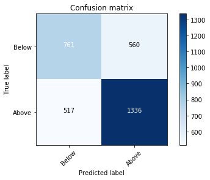
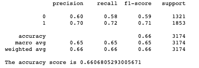
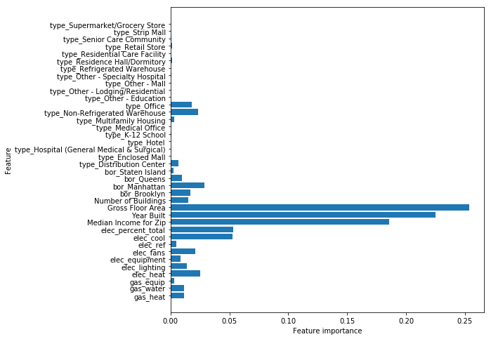

## NYC-Building-Energy-Intensity

This project attempts to classify whether a given building in NYC is above or below the national median in Source Energy Use Intensity (EUI) using building energy consumption data from the 2016 Energy and Water Data Disclosure for New York City Local Law 84. 

# Tech Stack 
- Python
- Pandas
- Matplotlib
- Seaborn
- Scikit-Learn

# EDA

For modeling I use feature and target data from New York City buildings from the 2016 calendar year. Data was cleaned, analyzed, and categorical data was label-encoded.

There was a fairly even distribution of buildings above (5,939) and below (4,639) the national median EUI. Dependent variable distribution viewed on a logarithmic scale below. Additionally, the change in distribution by building type between total sample and 95 percentile in EUI (labeled as "exteremely high") is shown in the two contrasting pie charts.

#Feature Engineering

Features used in final model are shown below. Building electricity and natural gas load estimates were computed according to DOE commercial building estimates. Continous variables were normalized and categorical variables were one-hot encoded. 

Included:
- Borough
- Number of Buildings on property
- Primary Property Type 
- Gross Floor Area (standardized)
- Year Built (standardized)

Engineered:
- Median Income for Zip (standardized)
- % electricity load attributed to equipment, lighting, cooling, refrigeration (each a separate feature)
- % gas load coming attributed to equipment, heating, water systems (each a separate feature)
- % of total energy demand coming from electricity 

# Modeling - Random Forest

Baseline model is random guessing. 56% of samples are above median and 44% are below. Question: given a building’s age, size, type, and load breakdown, is its EUI above or below the national median?

The Random Forest algorithm performed best with an accuracy of ~66%. 

# Feature Selection

The most important features were Gross Floor Area, Year Built, and Median Income for Zip. 

# Conclusions / Next Steps 
- Some samples had to be dropped because zip code median income data was missing. Sourcing and consistency in median income by zip code would help validity of the model.
- Individual load data for each building would make the model more helpful. 
- There is class imbalance with building type, so during train-test splits, smaller sample categories, like hospitals, could all be included in either the training set or testing set. 

