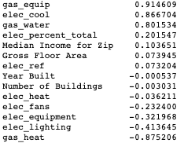
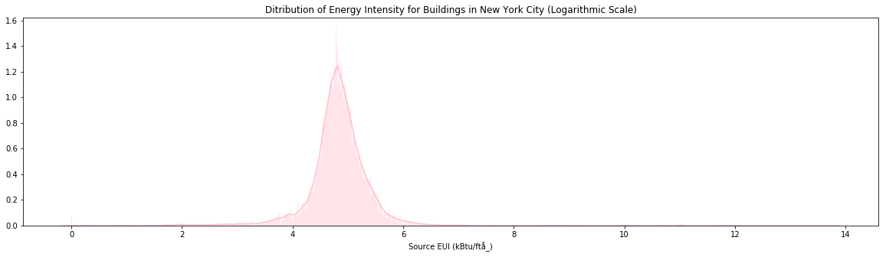
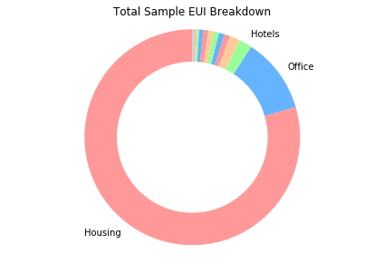
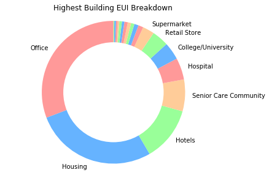

## NYC-Building-Energy-Intensity

This project attempts to classify whether a given building in NYC is above or below the national median in Source Energy Use Intensity (EUI) using building energy consumption data from the 2016 Energy and Water Data Disclosure for New York City Local Law 84. 

# Tech Stack 
- Python
- Pandas
- Matplotlib
- Seaborn
- Scikit-Learn

# EDA

For modeling I use feature and target data from New York City buildings from the 2016 calendar year. Data was cleaned, analyzed, and categorical data was label-encoded.

There was a fairly even distribution of buildings above and below the national median EUI. Dependent variable distribution viewed on a logarithmic scale below. Additionally, the change in distribution by building type between total sample and 95 percentile in EUI (labeled as "exteremely high") is shown in the two contrasting pie charts.

